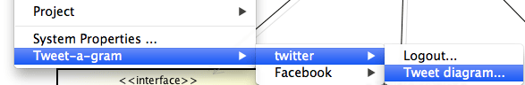

Tweet-a-gram plugin 2.0 (あすったー)
===============================================
日本語は[こちら](README_ja.md)

Lasted version
------------
[2.0.3](https://s3.amazonaws.com/astah_plugins/tweet-a-gram-plugin-2.0.3.jar)

Release Note
------------
[Here.](release_note.md)  

Available for
------------
Astah Community and Professional 6.7 or later.  
Astah Community and Professional under 6.6.4 or less are [Tweet-a-gram plugin 1.1](https://s3.amazonaws.com/astah_plugins/tweet-a-gram-plugin-1.1.3.jar)

Description
------------
This plug-in links to your twitter and facebook account and enables you to tweet your diagram.  

How to install
------------
0. [Download](https://s3.amazonaws.com/astah_plugins/tweet-a-gram-plugin-2.0.3.jar "Download") the jar file.  
1. Deploy the jar file in the "plugins" folder under the Astah Installation folder  
2. Launch Astah  
3. You find that the [Tweet-a-gram] menu is added under the [Tool] menu  
  
  
  
