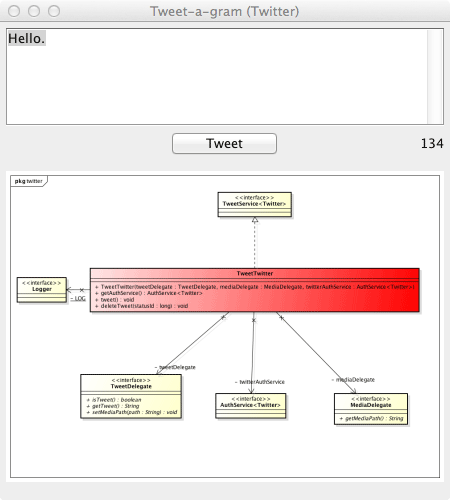

Tweet-a-gram plugin 2.0 (あすったー)
===============================================
[README.md](README.md) English

最新バージョン
------------
[2.0.3](https://s3.amazonaws.com/astah_plugins/tweet-a-gram-plugin-2.0.3.jar)

リリースノート（English）
------------
[こちら](release_note.md)  

実行可能なastah*バージョン
------------
astah* community, UML, professional 6.7以上。(astah* think 3.1でも動作確認済み)  
astah* community, UML, professional 6.6.4までの方は、[Tweet-a-gram plugin 1.1](https://s3.amazonaws.com/astah_plugins/tweet-a-gram-plugin-1.1.3.jar)を使用してください。

プラグインの説明
------------
このプラグインは、astah*で作成した図をtwitter、もしくは、facebookに投稿するプラグインです。  

インストール方法
----
0. [ここ](https://s3.amazonaws.com/astah_plugins/tweet-a-gram-plugin-2.0.3.jar "Download")からjarをダウンロードします。  
1. メニューより、[ヘルプ] - [プラグイン一覧...] を実行します。  
2. インストールボタンを押して、ダウンロードしたtweet-a-gram-plugin-x.x.x.jarを選択します。再起動を求められるので、astah*を再起動します。 
 
3. メニューより、[ヘルプ] - [プラグイン一覧...] を実行し、状態にチェックが付いていることを確認してください。  
  

使い方
----
A.1.  
twitterへつぶやく  
  
つぶやきボタン(図 A.a)を押します。もしくは、メニューより、[ツール] - [あすったー] - [twitter] - [つぶやく...] (図 A.b) を実行します。  
  
図 A.a つぶやきボタン  
  
図 A.b メニュー  
  
※1) twitterへの許可を取っていない場合は、A.1.〜A.5.の手順で許可を取ってください。  
※2) 一度許可を取れば、ログアウトしない限りそのままつぶやくことができます。  

A.2. twitterへ許可を取る  
初めてつぶやく場合はtwitterへの許可をとるため、図 A.cが表示されます。リンクをクリックしてブラウザを起動してください。  
      
図 A.c 認証
  
A.3. 連携するための認証  
連携するためにtwitterへログインします。  
      
図 A.d 認証
  
A.4. PINコードを入力  
ブラウザにピンコードが表示されるので、PINを入力して認証してください。  
  
A.5. つぶやく  
図のイメージが表示されるので、つぶやいてください！  
  
図 A.e 認証
  
A.6. ログアウト  
メニューより、[ツール] - [あすったー] - [twitter] - [ログアウト...] よりログアウトしてください。  
  
